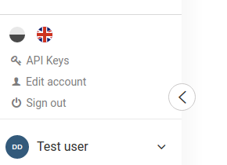
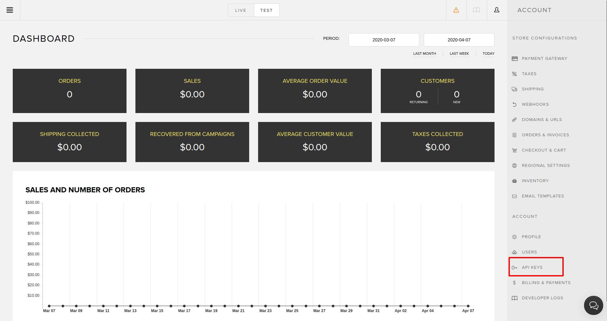

# Next.js E-Commerce Tutorial: Quick Shopping Cart Integration


The creation of tools such as Next.js that successfully simplified React frontend development.

Here, I want to explore what Next.js can do for e-commerce.

# README

Prerequisites:

1. Snipcart account
2. Flotiq account

Run:
```
npm install
```

Create `.env` file based on `.env.example` and fill out the data:

```
SNIPCART_NEXTJS_FLOTIQ_BASE_URL="https://api.flotiq.com"
GATSBY_FLOTIQ_API_KEY="GATSBY_FLOTIQ_API_KEY"
SNIPCART_API_KEY="SNIPCART API KEY"
```

You will find your Flotiq API_KEY here:




and your Snipcart API_KEY:



If you configured everything then run:

```
npm run dev
```

Your shop should be accessible at `http://localhost:3000`

> [Read the full tutorial](https://snipcart.com/blog/next-js-ecommerce-tutorial)

> [See the live demo](https://snipcart-nextjs.herokuapp.com/)
***
[](https://heroku.com/deploy?template=https://github.com/flotiq/snipcart-nextjs)

## 🎓 Learning Flotiq

If you're new to Flotiq, head over to [Flotiq Docs](https://flotiq.com/docs) to learn all about it and [Register your free Flotiq account](https://editor.flotiq.com/register.html).
